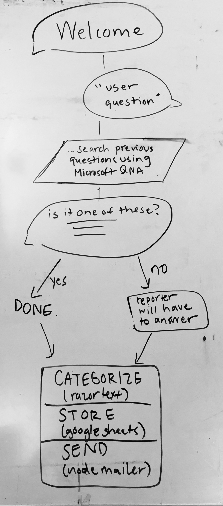

# chatty
In which we build a kind of functioning fancy chatbot

## Basic project flow

## Documentation

### Heroku Setup
1. Create a Heroku app
2. Create a Procfile with `web: node index.js`

### Text Razor Setup
1. Install the Text Razor SDK for NodeJS

### Google Sheets API Setup
1. Follow the instructions [here](https://developers.google.com/sheets/api/quickstart/nodejs).
  - make the redirect_uris `localhost:5000`
  - if you get an error that "installed" doesn't exist, just change the "web" key in `client_secret.json` to "installed"

## Outside Code
- [Text Razor](https://www.textrazor.com/docs/rest)
- [Text Razor SDK](https://github.com/wzbg/textrazor) by wzbg

## Helpful Links
- [Use Google Sheets As A Reporting Tool](https://codelabs.developers.google.com/codelabs/sheets-api/#1)
- [Prototyping: Chatfuel + Gomix + QnAMaker](https://stanfy.com/blog/quick-chatbot-prototyping/)

### Lindsay's Next Steps
- Continue through Google Sheets As A Reporting Tool starting [here](https://codelabs.developers.google.com/codelabs/sheets-api/#6)
